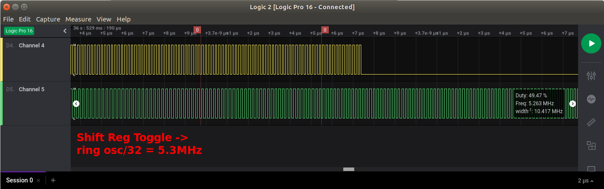
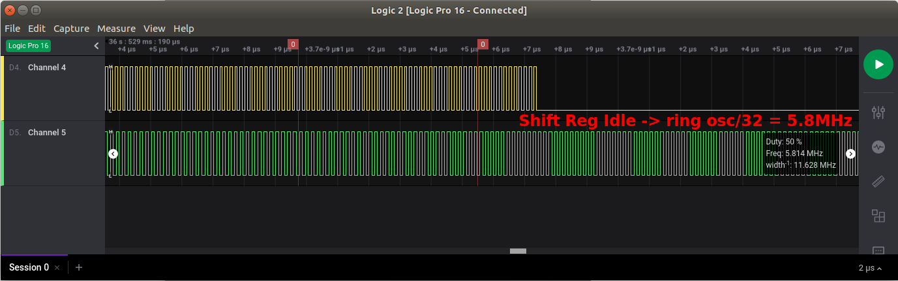
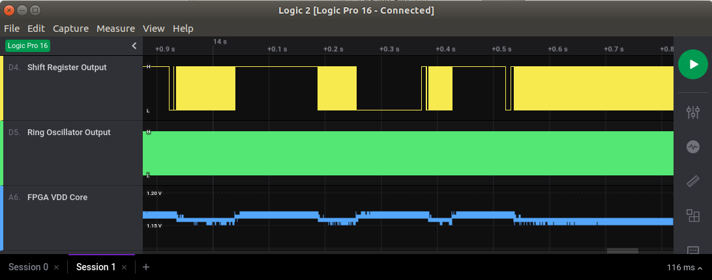

# Side Channel Communication Test

Checks the impact of FPGA toggle activity on the speed of a free-running ring oscillator
in that same FPGA.

I'm using an Intel Cyclone II EP2C5T144 development board for this.

The case here is extreme in that 3000 FFs of a shift register of the FPGA or continuously
toggling... or not.

That said: since 50% of the FFs of the shift register are going 0 to 1 and the other 50% are
going 1 to 0, the load on the power supply is the same for each clock cycle.

A more extreme case would be *all* 3000 FFs toggling 0 or 1 in the same clock cycle.

Pressing the button on the dev board will stop the toggling.

The output of the ring oscillator is divided by 32, sent to a GPIO and recorded with a Saleae Logic 16.

Results:

When the shift register is toggling, the ring oscillator divided by 32 runs at 5.3MHz.

When the shift register is idle, the clock raises to 5.8MHz.

The change in clock frequency happens in less than 6us, so it's almost certainly related to
a changing in VDD Core. When the shift register is toggling, VDD core is 1.15V. It's 1.16V when idle.

The EP2C5 FPGA has room for 4608 FFs, but when I increase the shift register from 3000 to 4000 FFs,
my dev board resets after a few seconds. The power regulator on the board is burning hot.

Meanwhile, the FPGA itself goes to ~53C when it stays toggling.

